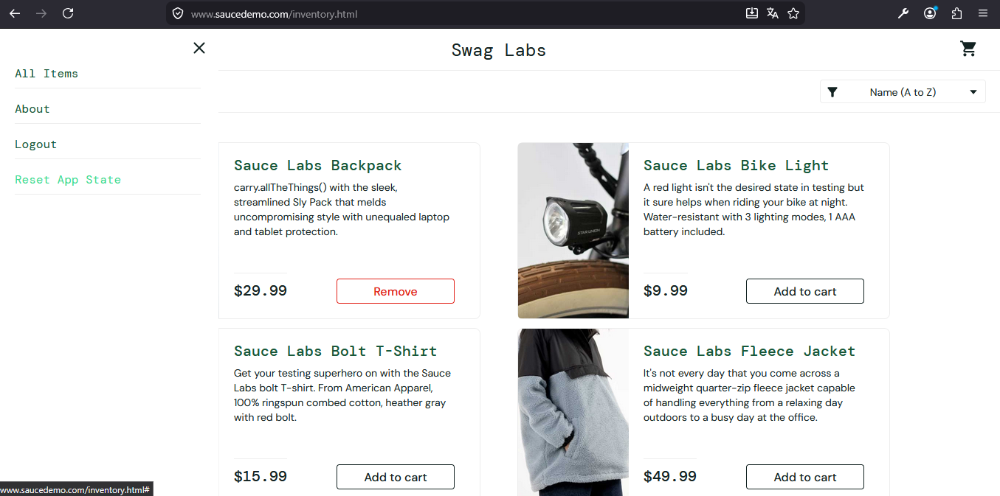

## No items in cart when finish purchase

**Severity:** Critical
**User(s) affected:** STANDARD
**Environment:** Any Browser, Any OS

### Steps to Reproduce
1. Login with STANDARD user
2. Add an item in the cart
3. Move to Cart.html and remove the item
4. Checkout button is visible and clickeable
5. Continue with the purchase.

### Expected Result
Checkout button should be disabled or app shouldn't let finish the purchase.

### Actual Result
Button is enabled and app lets finish the purchase without items.

### Evidence

### Notes

## Cart items not cleared after logout

**Severity:** High
**User(s) affected:** Any users
**Environment:** Any Browser, Any OS

### Steps to Reproduce
1. Log in with any user
2. Add items to a cart
3. Log out
4. Log in with same user
5. Items are still visible in the cart
6. Log out
7. Log in with different user
8. Items are still visible in the cart

### Expected Result
Cart should be empty after every log out.

### Actual Result
Cart is not empty after log out.

### Evidence

### Notes
There is an option in the menu that reset the cart which is not recomended; also there is a bug with that, buttons in the list items shows "Remove" label in the inventory.html